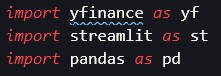
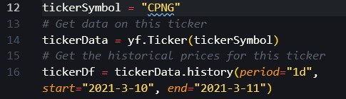

# Python Stock Price Checker
---

## _Description:_
### This is a simple stock price checking app using Python and "Streamlit"
 

### **1. Usage:**
#### 1) git-clone: git@github.com:ahnlok/python_stock_price_checker.git
#### 2) In your terminal, type: "pip install streamlit"
##### _- Type "streamlit hello" to check if streamlit is installed successfully"_
#### 3) Import

##### _- Make sure you import "yfinance", "streamlit", and "pandas"_
##### _- You probably need to install "yfinance" from your terminal "pip install yfinance"_
#### 4) You can modify/customize easily:

##### _- First, you can customize to look for different stock choice data by changing "line 12" _tickerSymbol_ to your choice._
##### _- Also, you can change the time frame you would like to pick for your stock in "line 16" with _tickerDf_._
#### 5) Start the app:
##### **Go to the terminal (make sure you are in the right repository), type "streamlit run stock.py"(or your own python file name)**
 

### **Github Repo: <https://github.com/ahnlok/python_stock_price_checker>**
## **Contact**
#### _E-Mail: <ansungpil1@gmail.com>_
#### _Github: <https://github.com/ahnlok>_
#### _LinkedIn: <https://www.linkedin.com/in/an-sungpil-95ab8490/>_